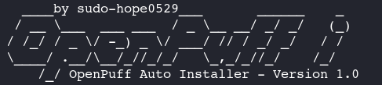

# OpenPuff Auto Install Script


## Overview
This repository contains a Bash script to automate the installation and configuration of OpenPuff (a steganography tool) with Wine 32-bit installation and its configuration.


## Prerequisites
- **Git**: Ensure Git is installed on your system.
- **Sudo Privileges**: The script requires administrative access.
- **Operating System**: Tested on Debian ( Kali Linux ), you can try on another at your own risk and knowledge.
- **Dependencies**: The script also installs all dependencies for openpuff


## Installation
Follow these steps to install and configure OpenPuff:

#### Clone the repository:
```
git clone https://github.com/sudo-hope0529/Openpuff-Auto-Install-2025.git
```

#### Change to the project directory:
```
cd Openpuff-Auto-Install-2025
```

Run the installation script with elevated privileges:
```
sudo bash openpuff_install.sh
```


## Usage
After successful installation, OpenPuff will be ready to use. Run the following command to verify:
```
openpuff  
```
this will open OpenPuff GUI.

> NOTE: Refer to the OpenPuff documentation for advanced usage and configuration options 


## Contributing
Contributions are welcome! Please fork this repository, make your changes, and submit a pull request.


## License
Licenced Under MIT Licence, Read [LICENCE](LICENCE).

## Sudo-Hope0529
[Read Documentation](https://sudo-hope0529.github.io/pages/comingsoon.html)
